# L-impiccato2.0 System Architecture

This document presents the detailed system architecture of the L-impiccato 2.0 (Hangman Game) project, showcasing the integration of computer vision, AI agents, and multi-modal input systems.

## System Architecture Overview

```mermaid
graph TB
    %% Frontend Layer
    subgraph "Frontend Layer 🖥️"
        direction TB
        MainApp["🚀 Main Application<br/>(main.py)<br/>Flet-based UI"]
        Layout["📐 App Layout<br/>(layout.py)<br/>UI Framework"]
        
        subgraph "UI Components 🧩"
            GamePanel["🎮 Game Panel<br/>(game_panel.py)<br/>Game Display"]
            MediaControls["🎛️ Media Controls<br/>(media_controls.py)<br/>Input Management"]
            HangmanVisual["🖼️ Hangman Visual<br/>(hangman_visual.py)<br/>Game Graphics"]
            Display["📺 Display<br/>(display.py)<br/>UI Rendering"]
            ManualInput["⌨️ Manual Input<br/>(manual_input.py)<br/>Text Input"]
        end
        
        subgraph "Recognition Components 🤖"
            HandDrawing["✍️ Hand Drawing Recognition<br/>(hand_drawing_recognition.py)<br/>Drawing Interface"]
            MediaDisplay["📹 Media Display<br/>(media_display.py)<br/>Camera & Animation"]
        end
        
        subgraph "Application Logic 🧠"
            StateManager["🎯 State Manager<br/>(state_manager.py)<br/>Game State (Singleton)"]
            GameLogic["🎲 Game Logic<br/>(game_logic.py)<br/>Hangman Rules"]
        end
    end
    
    %% Backend Layer
    subgraph "Backend Layer ⚙️"
        direction TB
        
        subgraph "Computer Vision 👁️"
            HandTracker["👋 Hand Tracker<br/>(tracker.py)<br/>MediaPipe Integration"]
            HandModel["🤲 Hand Model<br/>(hand_model.py)<br/>TensorFlow/Keras"]
            LetterModel["📝 Letter Recognition Model<br/>(letter_recognition.h5)<br/>Deep Learning Model"]
        end
    end
    
    %% AI Controller Layer
    subgraph "AI Controller Layer 🤖"
        direction TB
        Agent["🎯 AI Agent<br/>(agent.py)<br/>Game Strategy & Logic"]
        AgentFramework["🔧 Agents Framework<br/>Agent Runtime Environment"]
    end
    
    %% External Dependencies
    subgraph "External Dependencies 📦"
        direction TB
        MediaPipe["📹 MediaPipe<br/>Hand Detection"]
        TensorFlow["🧠 TensorFlow<br/>ML Framework"]
        OpenCV["👁️ OpenCV<br/>Computer Vision"]
        Flet["🖥️ Flet<br/>UI Framework"]
        SpeechRec["🎤 Speech Recognition<br/>Voice Input"]
        Agents["🤖 Agents Library<br/>AI Framework"]
    end
    
    %% Data Flow Connections
    MainApp --> Layout
    Layout --> GamePanel
    Layout --> MediaControls
    
    GamePanel --> StateManager
    GamePanel --> GameLogic
    GamePanel --> HangmanVisual
    GamePanel --> Display
    
    MediaControls --> HandDrawing
    MediaControls --> MediaDisplay
    MediaControls --> ManualInput
    MediaControls --> Agent
    
    HandDrawing --> HandTracker
    HandDrawing --> HandModel
    HandTracker --> MediaPipe
    HandModel --> LetterModel
    HandModel --> TensorFlow
    
    Agent --> StateManager
    Agent --> AgentFramework
    Agent --> Agents
    
    MediaControls --> SpeechRec
    HandTracker --> OpenCV
    MainApp --> Flet
    
    %% Styling
    classDef frontend fill:#e1f5fe,stroke:#01579b,stroke-width:2px
    classDef backend fill:#f3e5f5,stroke:#4a148c,stroke-width:2px
    classDef ai fill:#fff3e0,stroke:#e65100,stroke-width:2px
    classDef external fill:#e8f5e8,stroke:#1b5e20,stroke-width:2px
    classDef component fill:#fff8e1,stroke:#f57f17,stroke-width:2px
    
    class MainApp,Layout,GamePanel,MediaControls,HangmanVisual,Display,ManualInput,HandDrawing,MediaDisplay,StateManager,GameLogic frontend
    class HandTracker,HandModel,LetterModel backend
    class Agent,AgentFramework ai
    class MediaPipe,TensorFlow,OpenCV,Flet,SpeechRec,Agents external
```

## Architecture Components Description

### 🖥️ Frontend Layer
The presentation layer built with **Flet** framework, providing a modern cross-platform GUI.

- **Main Application**: Entry point orchestrating the entire application lifecycle
- **UI Components**: Modular interface elements for game interaction
- **Recognition Components**: Camera and drawing interfaces for multi-modal input
- **Application Logic**: Game state management and business rules

### ⚙️ Backend Layer  
The computational engine handling computer vision and machine learning tasks.

- **Hand Tracker**: Real-time hand detection using MediaPipe
- **Hand Model**: Letter recognition from hand gestures using TensorFlow
- **Recognition Model**: Pre-trained deep learning model for character classification

### 🤖 AI Controller Layer
Intelligent game management using AI agents framework.

- **AI Agent**: Strategic game logic and decision making
- **Agent Framework**: Runtime environment for AI agent execution

### 📦 External Dependencies
Third-party libraries and frameworks powering the system.

## Data Flow Architecture

```mermaid
sequenceDiagram
    participant U as 👤 User
    participant UI as 🖥️ Frontend
    participant CV as 👁️ Computer Vision
    participant AI as 🤖 AI Agent
    participant GM as 🎯 Game Manager
    
    U->>UI: Draws letter with hand
    UI->>CV: Capture hand gesture
    CV->>CV: Process with MediaPipe
    CV->>CV: Recognize letter (TensorFlow)
    CV->>UI: Return predicted letter
    UI->>AI: Send letter guess
    AI->>GM: Update game state
    GM->>GM: Check game rules
    GM->>AI: Return game status
    AI->>UI: Send response
    UI->>U: Display result
```

## Technology Stack

| Layer | Technologies |
|-------|-------------|
| **Frontend** | Flet, Python |
| **Computer Vision** | MediaPipe, OpenCV, TensorFlow/Keras |
| **AI/ML** | Agents Framework, Deep Learning Models |
| **Audio** | SpeechRecognition, PyAudio |
| **Core** | Python 3.10+ |

## Key Features

- 🎯 **Multi-modal Input**: Hand gestures, voice, and keyboard input
- 👁️ **Real-time Computer Vision**: Live hand tracking and letter recognition
- 🤖 **AI-powered Gameplay**: Intelligent game management and hints
- 🖥️ **Cross-platform UI**: Modern interface built with Flet
- 🧠 **Deep Learning**: Custom-trained letter recognition model
- 🎮 **Interactive Gaming**: Visual hangman with smooth animations

## System Requirements

- Python 3.10+
- Webcam for hand gesture recognition
- Microphone for voice input (optional)
- Compatible with Windows, macOS, and Linux

---

*This architecture supports extensible multi-modal interaction patterns and can be easily extended with additional input methods or AI capabilities.*
